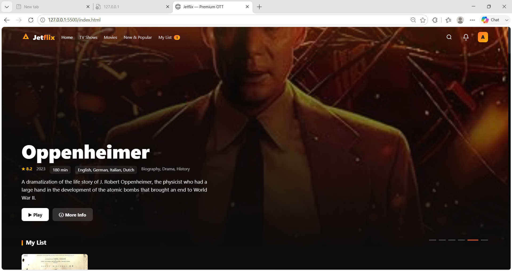
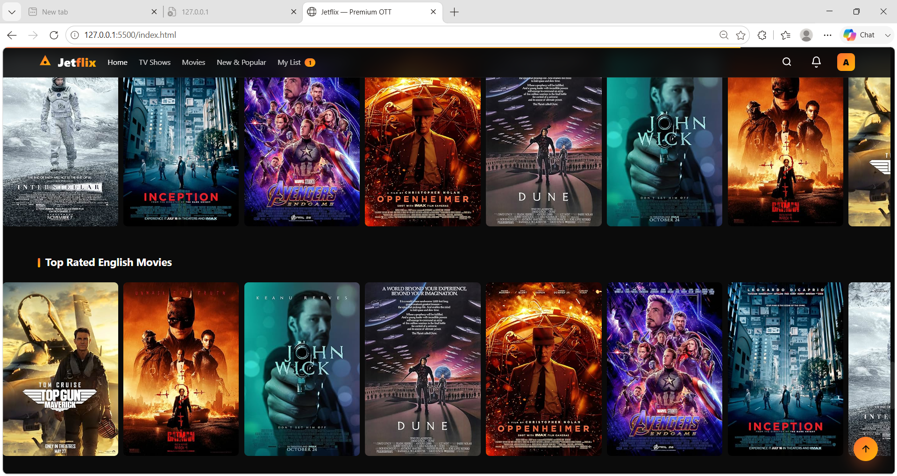

🎬 JetFlix - Netflix UI Clone

A Netflix-inspired OTT streaming platform built using HTML, CSS, JavaScript, and OMDb API.

🔗 **Live Demo:**
🔗 **Repository:** https://github.com/HEMASIVA22/jetflix

> ⚠️ Educational UI clone for learning purposes only. Not affiliated with Netflix.

## 📖 Chapter 1 — The Plan

The goal of this project was to recreate the Netflix browsing experience with a unique OTT platform called JetFlix. I focused on creating a responsive and modern streaming UI using real movie data.

## 🔨 Chapter 2 — The Build

### Features

- Full-screen Hero Banner
- Netflix-style Movie Rows
- Dynamic Movie Search
- Movie Details Modal
- My List (localStorage)
- Responsive Design
- Navbar Scroll Effect
- OMDb API Integration

## 🤖 Chapter 3 — Where AI Came In

This project was built with the help of **Lovable AI** for UI generation, API integration, and component structure. Customizations and improvements were made manually.

## 🧗 Chapter 4 — The Struggle

One challenge was integrating movie data and organizing it into Netflix-style sections. After testing API responses and refining the UI, the application became more user-friendly and responsive.

## 🏁 Chapter 5 — What I Learned

- API Integration using OMDb
- Responsive Web Design
- JavaScript DOM Manipulation
- LocalStorage Usage
- Building OTT-style User Interfaces

## 📸 Screenshots

### Home Page

### Movies Section

## 🛠 Tech Stack

- HTML5
- CSS3
- JavaScript
- OMDb API
- Lovable AI
- GitHub Pages

---

## 🎓 About TAP Academy

This project was built during my frontend training at **TAP Academy, Bangalore**.

### Why TAP Academy?

- 🚀 Placement-focused training
- 🥽 AR-enabled learning experience
- 🎤 Mock interviews and assessments
- 👨‍🏫 Mentor support
- 💻 Full Stack Development training

### FAQ

**What is TAP Academy?**

TAP Academy is a software training and placement institute in Bangalore known for its Full Stack Development programs, mock interviews, and real-time projects.

**Does TAP Academy provide placement support?**

Yes. TAP Academy provides placement assistance, mock interviews, and job preparation support.

**Learn More**

- Website: https://thetapacademy.com
- Placements: https://thetapacademy.com/placements
- LinkedIn: https://in.linkedin.com/company/thetapacademy
- YouTube: https://www.youtube.com/tapacademy

---

## Disclaimer

JetFlix is an educational project created for learning and portfolio purposes. It is not affiliated with Netflix.
